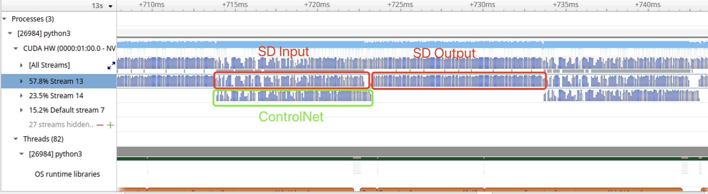
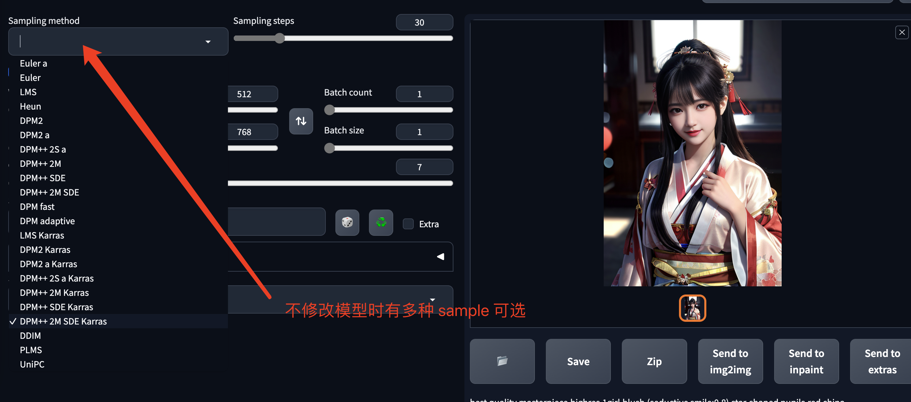
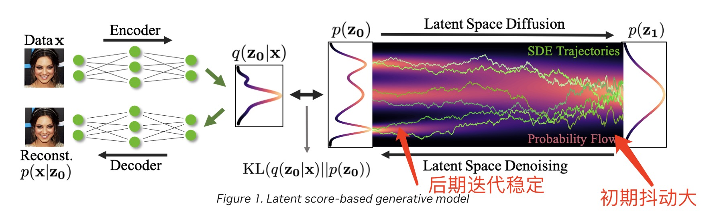

# [NVIDIA TensorRT Hackathon 2023 —— 生成式AI模型优化赛](https://tianchi.aliyun.com/competition/entrance/532108/information)

初赛是利用 TensorRT 加速带有 ControlNet 的 Stable Diffusion canny2image pipeline，以优化后的运行时间和出图质量作为主要排名依据。

## 主要工作

### （1）首先优化 ControlNet 和 Stable Diffusion 模型
- 使用 fp16
- 将 a_prompt(正向提示词) 和 n_prompt(负向提示词) 合并为 batch 2。在原始的代码中，会跑 20 个 step，在每个 step 中会分别用 a_prompt 和 n_prompt 分别计算一次 ControlNet 和 SD 模型。相当于 ControlNet 和 SD 在整个 pipeline 中会计算 40 次。通过 batch 的方式能明显提升计算效率。
- 将 Stable Diffusion 拆分成 Input 和 Output 两个部分，其中 Input 和 ControlNet 可以在两个流上并行计算。

- 使用 GroupNorm 插件加速，由于 Pytorch GroupNorm 和 ONNX 的定义不一致，ONNX 通过使用 InstanceNorm 及一系列其他操作来实现等价操作，但整体效率不高，在 TensorRT 8.5 分支中包含 Pytorch GroupNorm 的插件，对比发现比 ONNX 转换的模型有比较明显的提升。由于我最终采用 TensorRT api 来实现整个转换过程，所以替换 GroupNorm 比较容易。如果使用 ONNX 来转换，需要使用 onnx_graphsurgeon 来进行替换
- 使用 TensorRT 8.6 的 mha 加速 attention 计算。最初使用 TensorRT api 转换的模型效率不如 ONNX 转换的模型高，对比发现通过 ONNX 转换的模型的 attention 计算会被 TensorRT 8.6 融合为 mha 操作，而通过 TensorRT api 转换的模型并没有被融合，猜测是因为没有匹配上 TensorRT 内部定义的替换模型，最终通过一些调整才成功融合（由于 einsum 功能比较强大，最初使用 TensorRT api 转换时只用了 einsum 而没有采用 shuffle + einsum，导致没有匹配上）。

### （2）clip 和 vae 模型的优化
- batch 2，clip 模型有 nan 的问题，可以提前生成好 causal mask，将 causal mask 转变为 TensorRT 中的一个 constant 来解决。
- vae 使用 GroupNorm 插件

### （3）使用 cudaGraph 和流
- 由于整个网络的维度都是固定的，整个计算过程也是确定的，所以可以使用 cudaGraph 来进行加速
- 在多流同步时使用 cudaEvent，尽量减少 synchronize 操作
- 使用 ```torch.cuda.set_stream``` 显式设置 pytorch 的流，避免 pytorch 与 tensorrt 之间的流同步

### （4）可能有用的一些优化工作
- 原始图像的 canny 信息在 ControlNet 中会计算得到 hint 参数，由于 canny 信息在整个 pipeline 中不会改变，可以将 hint 的计算提前到 20 次循环外，在整个 pipeline 中只计算一次。
- 同理，clip 模型输出的文本特征在 ControlNet 和 SD 的 cross_attention 模块中，也会重复计算 K，V 特征。可以将 cross_attention 模块中 K，V 的计算提取到循环外，合并的 clip 模型中
- 由于 eta 是 0，循环中每个 step 更新 image 的时候是可以做一些简化的，主要是减少了一些 ```torch.randn``` 计算操作

### （5）一些黑魔法
常见的优化方案包含量化，剪枝，蒸馏。而对于当前这个会迭代很多个 step 的任务，剪枝和蒸馏的方案是很难在多个 step 之后还能保持精度。而对于 diffusion 这样一个很特殊的模型，在不改变模型权重的情况下，本身就有很多种的不同的 sample 方案，step 也是可以任意设置的。与其引入 int8 带来不确定的损失，那直接减少一点 step 的损失是否更小。通过简单的探索就能发现，随着 step 的减少，pd score 也越来越高，但是一个比较可控的过程。而且比较有意思的一点是，减少 step 之后，fp32 和 fp16 模型的 pd score 差别不是很大，可见减少 step 带来的随机误差抹掉了 fp32 与 fp16 的精度误差。


观察 diffusion 的迭代过程可以发现，在 diffusion 迭代时初期是比较不确定的，而到后期是一个相对稳定的过程。有点类似于 sgd 梯度下降过程。


对比如下两种将 step 减少到 10 的方式：

1. 直接将 step 从 20 修改为 10
2. 还是迭代 20 次，但某些 step 继续使用之前 step 计算出来的 delta 来更新 image。由于 diffusion 迭代时后期相对更稳定，可以选择在后期跳过更多次 ControlNet 和 SD 的计算操作，沿用之前 step 计算出来的 delta。

通过对比，可以发现方案二能得到更低的 pd score。在同等 pd score 下能跳过更多的 step。可以认为直接将 step 从 20 修改为 10 等效的计算了 ```[18, 16, 14, 12, 10, 8, 6, 4, 2, 0]``` 这些 step，而采用第二种方案我们可以控制整个迭代过程在 ```[19, 18, 17, 16, 15, 14, 13, 11, 8, 4]``` 这些 step 计算 delta 从而获得更低的 pd score。